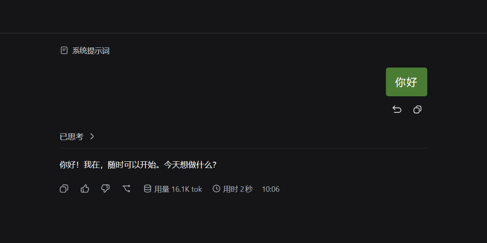

# dsh-plugin-wechat-bubble（微信气泡插件）

> 版本 `260930-101335` · 作者：大江

把 DSH Web 界面里 **你发出的消息气泡** 改成微信经典样式。纯前端 CSS 插件，无后端逻辑，不改任何功能。

- **版本**：3.0.0（跨 DSH 构建通吃，双气泡结构全覆盖）
- **平台**：DSH Web（浏览器端 client plugin）
- **入口**：`index.js`（宿主侧空壳）→ 真正工作在 `client.js`
- **配置注入**：无（纯 CSS，无 config）

## 效果

- 微信绿气泡：浅色 `#95EC69` / 深色 `#4A7C34`（自动适配暗色主题）
- 微信小尾巴：气泡右边缘靠上的小三角，指向头像方向
- 字号 +2px、行高 +2px、字间距 +10%（`0.1em`，随字号自动缩放）
- 内边距加大到 `12px 16px`，圆角 6px，右对齐

只改用户气泡：**AI 回复、系统消息、代码块、工具卡片、头像、图片、时间戳行全部保持原样**。

## 安装（link 源码目录，当前 DSH 本地插件规范）

本插件已挂到 **`web` profile**（3080 GUI 实际运行的 profile），源码目录：

```
D:\DSH_HOME\dsh\profiles\web\plugins\dsh-plugin-wechat-bubble\
```

安装链路（已完成）：
1. 插件源码放 `<profile>\plugins\dsh-plugin-wechat-bubble\`
2. `<profile>\package.json` 加依赖 `"dsh-plugin-wechat-bubble": "link:plugins/dsh-plugin-wechat-bubble"`
3. `dsh.profile.bundles` 数组加 `"dsh-plugin-wechat-bubble"`
4. profile 目录跑 `pnpm install`（生成 node_modules junction）
5. **重启 DSH**（新增插件行需要重启加载；只改 CSS 内容则刷新页面即可）

卸载：去掉 package.json 依赖 + bundles 条目，跑 `pnpm install`，重启。

## 工作原理

通过 `ctx.effect` 注入一个 `<style>` 标签（插件卸载/HMR 时自动移除），同时启动
150ms 持续轮询对气泡写内联样式（双保险）。CSS 覆盖**三种用户气泡结构**：

1. **官方 `_bubble` class**（前缀无关）：`[class*='_userRow'] [class*='_bubble']`
   —— 匹配 CSS-module 哈希后缀，跨 DSH 构建通吃（0.1.x `Sixlwa_`、0.2.x `cJsG2q_`
   等都能命中），不再需要每次升级改前缀。
2. **无 class 纯文本消息**（v3.0.0 新增）：
   `[class*='flowItem'] div[style*='flex-end'] > div[style*='max-width']`
   —— DSH 对纯文本用户消息使用另一种 DOM 结构（无 `_bubble` class），
   通过右对齐 flex 容器 + max-width 内联样式定位。这是日常发消息的主要形态。
3. **dsh-easyrewrite 插件气泡**：`div[data-dsh-easyrewrite='user'] > div[title]`
   —— 该目标带行内样式，必须用 `!important` 才能覆盖。

所有规则均加 `!important`（压过 React 的内联 style prop）。轮询每 150ms 全量
重画所有用户气泡的内联样式（`setProperty(..., "important")`），确保即使 React
重渲染替换了 DOM 节点，颜色也能在一个 tick 内恢复。

只覆盖 `background`、`border-radius`、`padding`、`font-size`、`line-height`、
`letter-spacing`，外加 `position: relative` 作为尾巴的定位上下文；文字颜色、
头像、图片布局全部交给宿主渲染器。

## 重要坑位：dsh-easyrewrite「抢走」气泡渲染器（v1.0.1 修复）

**症状**：插件的 `<style>` 和规则都在页面里，但气泡不变绿，CSS「完全没生效」。
**原因**：dsh-easyrewrite（用户消息编辑/撤回）插件**替换了官方气泡渲染器**——
气泡不再是 `.Sixlwa_bubble`，而是一个无 class 的 `<div title="点击编辑">`，
背景来自**行内样式**（`background: var(--dsw-alias-interactive-bg-hover, …)`）。
原 CSS 必败的两个独立原因：
1. 元素上根本没有 `.Sixlwa_bubble` 这个类；
2. 就算选择器写对了也会输——行内样式压过一切样式表规则。
**修复（v1.0.1）**：双目标选择器 + `!important`，装不装 easyrewrite 都生效。

### 类似「CSS 不生效」问题的排查方法

1. **先检查真实元素**：DevTools 检查气泡，你选中的 class 还在不在？
   不在 = 渲染器被别的插件替换了，你的选择器指向的是幽灵。
2. **找归属**：`grep -rn "data-xxx" <profile>/node_modules/*/lib/client.js`。
   插件自有的 `data-*` 属性是最稳的锚点（不怕换语言、不怕 CSS 哈希变化）。
   已装插件清单在 `<profile>/package.json`。
3. **看谁赢了**：Styles 面板里找计算值的获胜声明；赢家是行内样式时，
   只有样式表里的 `!important` 能压过它。
4. **匹配属性存在性，别匹配文本**：`div[title]`（存在性）不怕换语言，
   匹配 title 文案（如"点击编辑"）在英文/日文下会失效。
5. **保留双目标**：两个渲染器共存期间保留双目标 CSS，各自缺席时规则无害。

**修复方法**：改安装目录里的 `client.js` 后直接刷新页面——client bundle
每次请求都从磁盘读取（no-cache），**不需要重启服务**；只有增删插件才需要重启。

## 参数怎么调

无配置项。想调整视觉效果，直接改 `client.js` 顶部的 `css` 数组：

| 键 | 值 | 含义 |
|---|---|---|
| `#95ec69` | 浅色绿 | 微信发送气泡绿 |
| `#4a7c34` | 深色绿 | 暗色主题下调暗，保证文字可读 |
| `border-radius: 6px` | 圆角 | 微信的含蓄圆角 |
| `padding: 12px 16px` | 内边距 | 更透气的留白 |
| `right: -7px` | 尾巴 | ::before 小三角 |

## 踩坑：CSS-module 哈希变化（本次 1.1.0 适配根因）

**症状**：插件照旧安装、`<style>` 存在，但气泡没有任何微信样式。
**原因**：DSH Web 每个构建给 CSS-module 类名生成哈希前缀。旧版本选择器写的是
`gdEzaW_bubble`（出自 `dsh-client-ui-conversation`）；当前构建该模块已迁移到
`@deepseek-ai/dsh-client-ui-chat`，哈希变成 `Sixlwa`（`Sixlwa_bubble`）。
**修复（1.1.0）**：选择器更新为 `body .Sixlwa_userRow .Sixlwa_bubble`，并把作用域
收进用户行容器，避免误伤复用同一模块的其他表面。
**下次失效怎么查**：DevTools 检查用户气泡的 class（应形如 `Xxxxx_bubble`），
把 `client.js` 里的 `Sixlwa` 前缀替换为新哈希后刷新页面即可；若用户气泡已不是
该结构（比如又被别的插件替换渲染器），按上文「排查方法」第 1、2 步找新锚点。

## 更新记录

- **1.0.1** — 重大 bug 修复：dsh-easyrewrite 替换气泡渲染器（无 class +
  行内样式），原 CSS 完全失效；改为双目标选择器 + `!important`（见上方坑位）。
- **1.0.5** — 其后全部小改动：微信小尾巴、字号 +2px / 字间距 +10% /
  内边距加大、文档中文化并定格。
- **1.1.0** — 适配 DSH 0.1.x（2026-09 构建）：CSS-module 类名从
  `gdEzaW_bubble` 迁移到 `Sixlwa_userRow .Sixlwa_bubble`；client 注册壳对齐
  现役插件（`__ModuleLoader__.load` + `{name, inject, apply}`）；宿主侧改为
  `export default {name, apply}`；挂载方式从 tgz 改为 profile `plugins/` +
  `link:` 源码目录。
- **2.0.0** — 减法收敛版：选择器前缀无关化（`[class*='_userRow'] [class*='_bubble']`），
  跨 DSH 构建通吃；加 MutationObserver 内联样式兜底，连发场景修好。
- **2.1.0 ~ 2.3.0** — 交叉对话场景尝试：AI 回复后延迟重画 / burst 轮询 /
  `!important` 内联，均未解决（根因不在时序）。
- **3.0.0** — **彻底修复**。根因：DSH 有两种用户气泡 DOM 结构，纯文本消息走
  无 class 的 `flowItem > flex-end > max-width` 路径，之前选择器完全没覆盖到。
  新增 `FLOW_BUBBLE` 选择器 + 全规则 `!important` + 150ms 持续轮询双保险。
  交叉对话、连发、AI 回复后重渲染——全绿稳定。

## 开源协议

MIT。
